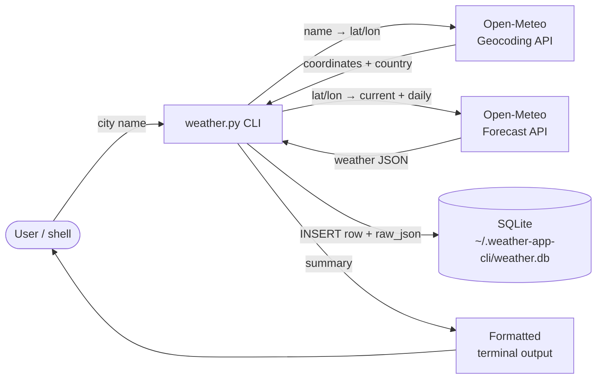

# weather-app-cli

A small, dependency-light Python CLI that fetches the current weather for any
city from the free [Open-Meteo](https://open-meteo.com/) API and logs every
lookup to a local SQLite database — so you build a personal, queryable history
of conditions over time.

---

## Project description & the problem it solves

Most weather tools are built to answer *"what is the weather right now?"* and
then forget the answer the moment the window closes. That's fine for a quick
glance, but it's useless if you ever want to:

- look back at how cold it actually was on a specific morning,
- compare conditions across cities you've checked recently,
- export a personal dataset of weather observations for analysis or
  experimentation,
- run weather lookups from scripts, cron jobs, or shell aliases without
  needing an API key.

`weather-app-cli` solves this by being two things at once:

1. **A friendly terminal client** — type `python weather.py San Francisco`
   and get a clean, human-readable summary (current temperature, feels-like,
   humidity, wind, today's high / low, and a plain-English condition).
2. **A persistent logger** — every successful lookup is appended as a row to
   a local SQLite database (`~/.weather-app-cli/weather.db`), including the
   full raw JSON response. Nothing is ever overwritten, so the database
   doubles as a personal weather journal you can query with standard SQL.

It needs no API key, has a single runtime dependency (`requests`), and runs
anywhere Python 3 runs.

---

## Architecture overview

The CLI is a single-process pipeline: the user supplies a city name, the
program resolves it to coordinates, fetches current + daily weather, formats
output for the terminal, and persists a row to SQLite. Everything else
(retries, caching, scheduling) is intentionally left to the surrounding shell
or operating system.



### Internal module layout

The whole program is one file (`weather.py`) split into small, single-purpose
functions so each step can be tested or reused independently:

| Function          | Responsibility                                                    |
| ----------------- | ----------------------------------------------------------------- |
| `parse_args`      | Parse the city argument (handles multi-word names without quotes).|
| `geocode`         | Resolve a city name to latitude / longitude via Open-Meteo.       |
| `fetch_weather`   | Pull current + daily weather for those coordinates.               |
| `init_db`         | Create the SQLite file and `weather_lookups` table if missing.    |
| `save_record`     | Insert one row per successful lookup, including the raw JSON.     |
| `format_output`   | Render the human-readable terminal summary.                       |
| `main`            | Orchestrate the pipeline and translate errors into exit codes.    |

### Data model

A single table, append-only:

```sql
CREATE TABLE weather_lookups (
  id                     INTEGER PRIMARY KEY AUTOINCREMENT,
  fetched_at             TEXT    NOT NULL,  -- UTC ISO-8601
  city_input             TEXT    NOT NULL,  -- exactly what the user typed
  resolved_name          TEXT    NOT NULL,  -- canonical name from geocoder
  country                TEXT,
  latitude               REAL    NOT NULL,
  longitude              REAL    NOT NULL,
  temperature_c          REAL    NOT NULL,
  apparent_temperature_c REAL,
  humidity_pct           INTEGER,
  wind_speed_kmh         REAL,
  weather_code           INTEGER,           -- WMO code
  weather_description    TEXT,              -- e.g. "Partly cloudy"
  high_c                 REAL,
  low_c                  REAL,
  raw_json               TEXT    NOT NULL   -- full forecast response
);
```

### Error model

The CLI exits with `0` on success and `2` on any failure (unknown city,
network error, non-2xx response from Open-Meteo). All error messages are
written to `stderr` so they don't pollute pipelines that consume the
formatted output on `stdout`.

---

## Tech stack

| Layer            | Choice                                                          | Why                                                        |
| ---------------- | --------------------------------------------------------------- | ---------------------------------------------------------- |
| Language         | Python 3.10+                                                    | Ubiquitous, batteries-included, ideal for small CLIs.      |
| HTTP client      | [`requests`](https://requests.readthedocs.io/)                  | Simple, well-known, the only third-party dependency.       |
| Argument parsing | `argparse` (stdlib)                                             | No extra dependency; handles multi-word city names.        |
| Storage          | `sqlite3` (stdlib)                                              | Zero-config, single-file DB; queryable with any SQL tool.  |
| Weather data     | [Open-Meteo](https://open-meteo.com/) Forecast + Geocoding APIs | Free, no API key, generous rate limits.                    |
| Condition codes  | [WMO weather codes](https://www.nodc.noaa.gov/archive/arc0021/0002199/1.1/data/0-data/HTML/WMO-CODE/WMO4677.HTM) | Standard mapping from numeric code to plain-English label. |

---

## Setup & run instructions

### Prerequisites

- Python **3.10 or newer** (uses the `dict[int, str]` style type hints).
- An internet connection (Open-Meteo is called over HTTPS).
- No API key — Open-Meteo is free for non-commercial use.

### Install

Clone the repo, then create and activate a virtual environment so the
dependency stays isolated from your system Python:

```sh
git clone <this-repo-url> weather-app-cli
cd weather-app-cli

python3 -m venv .venv
source .venv/bin/activate           # Windows: .venv\Scripts\activate

pip install -r requirements.txt
```

### Run

```sh
python weather.py San Francisco
python weather.py Reykjavik
python weather.py "New York"        # quotes optional — multi-word names work either way
```

### Optional: install as a shell command

Make `weather` callable from anywhere by symlinking the script onto your
`PATH` (the shebang line and the executable bit do the rest):

```sh
chmod +x weather.py
ln -s "$PWD/weather.py" /usr/local/bin/weather

weather Tokyo
```

### Inspect your lookup history

The database is created on first successful run at
`~/.weather-app-cli/weather.db`. Query it with the standard `sqlite3` CLI:

```sh
sqlite3 ~/.weather-app-cli/weather.db \
  "SELECT fetched_at, city_input, temperature_c, weather_description
     FROM weather_lookups
    ORDER BY id DESC
    LIMIT 10;"
```

Or export to CSV:

```sh
sqlite3 -header -csv ~/.weather-app-cli/weather.db \
  "SELECT * FROM weather_lookups;" > weather_history.csv
```

### Reset the database

It's just a file — delete it and the next run will recreate it:

```sh
rm -rf ~/.weather-app-cli
```

---

## Screenshots

### Terminal output

```
$ python weather.py San Francisco
San Francisco, United States
Now: 14.2°C (feels 13.0°C) · Partly cloudy
Humidity: 72% · Wind: 12.4 km/h
Today: H 18.4°C / L 11.1°C
```

```
$ python weather.py Reykjavik
Reykjavík, Iceland
Now: 4.8°C (feels 1.2°C) · Light rain
Humidity: 88% · Wind: 22.6 km/h
Today: H 6.1°C / L 3.0°C
```

```
$ python weather.py Atlantis
weather: error: city 'Atlantis' not found
$ echo $?
2
```

> _Tip: drop a real terminal screenshot at `docs/screenshot.png` and reference
> it here as `` if you'd like an image
> instead of a code block._

### Querying the SQLite history

```
$ sqlite3 ~/.weather-app-cli/weather.db \
>   "SELECT fetched_at, resolved_name, temperature_c, weather_description
>      FROM weather_lookups ORDER BY id DESC LIMIT 5;"
2026-05-07T08:14:02+00:00|San Francisco|14.2|Partly cloudy
2026-05-07T08:13:41+00:00|Reykjavík|4.8|Light rain
2026-05-06T19:02:18+00:00|Tokyo|21.5|Clear
2026-05-06T07:45:09+00:00|New York|11.0|Overcast
2026-05-05T22:11:55+00:00|San Francisco|13.7|Mainly clear
```

---

## License

This project is provided as-is for personal and educational use. Weather data
is provided by [Open-Meteo](https://open-meteo.com/) under their terms of
service.
